# FR-MRInet: An Encoder-Decoder for Brain Tumor Segmentation

FR-MRInet is a deep convolutional encoder used in an auto-encoder that takes an MRI scan of a brain as input and generates an output that highlights the tumor (if present).   
## Input and Ground Truth

  
  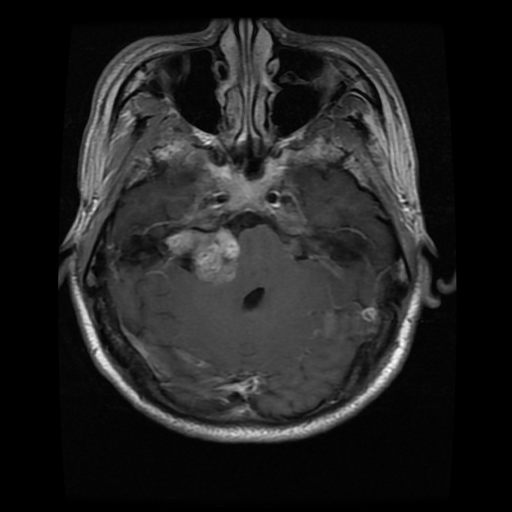
  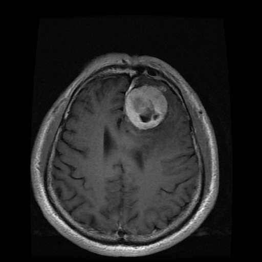
  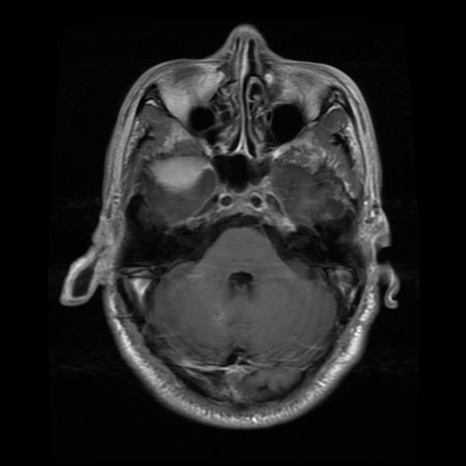
  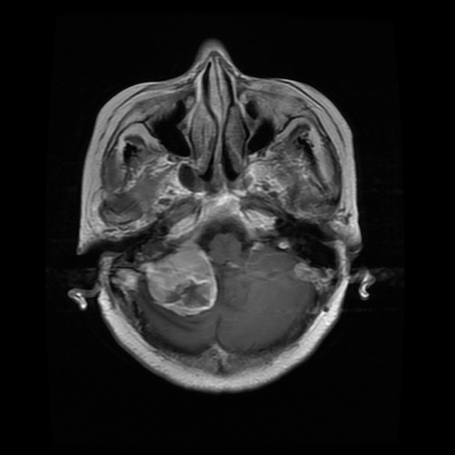

  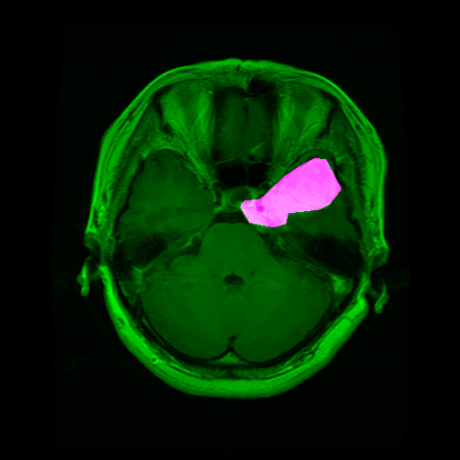
  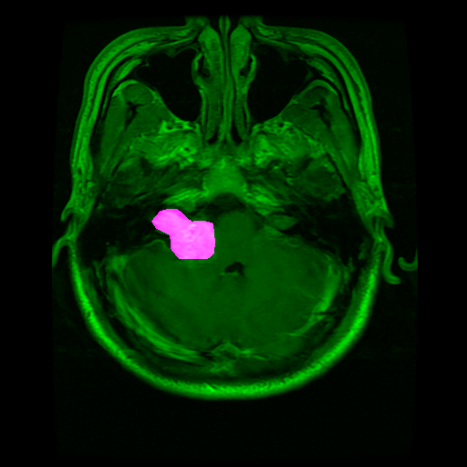
  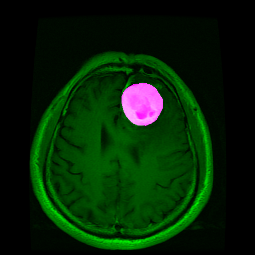
  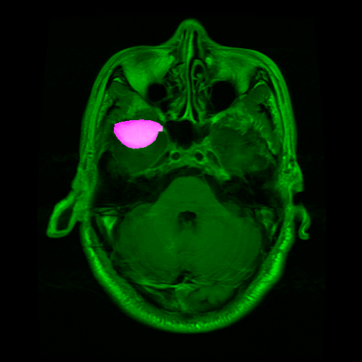
  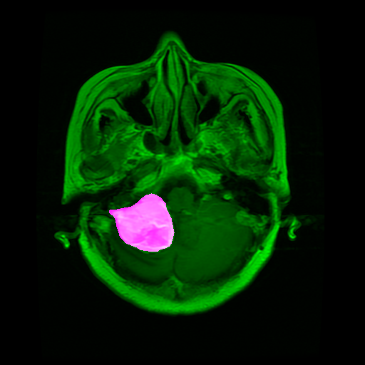

## Predictions

  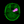
  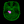
  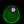
  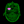
  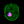

## Performance in live images

  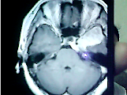
  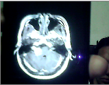

  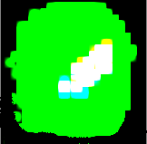
  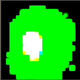

The model takes input images with resolution of 64 * 64 * 1 and generates an output of 24 * 24 * 3. It takes about 600-700 epochs for 
the model to converge.   

## Dataset 
Link: https://figshare.com/articles/brain_tumor_dataset/1512427

## Prerequisites
1. Tensorflow v1.5 (This version was used in the experiment. It may or may not work with older versions)
2. TFlearn API
3. Python 3.x 
4. Numpy
5. Tensorboard (optional)

## Codes
model.py holds the total architectural design of the autoencoder.   
main.py is used for training and validating the model.  
File loader.py is a helper class that helps to search and load iamges.
